# Apsara 2.5

Apsara 2.5 is an advanced AI assistant application leveraging Google's Gemini API to provide interactive chat, live conversation, and multimodal capabilities. This application combines the power of large language models with a user-friendly interface to deliver a comprehensive AI assistant experience.

## Project Overview

Apsara 2.5 is a full-stack JavaScript application with the following architecture:
- **Frontend**: React-based single-page application with Tailwind CSS
- **Backend**: Node.js/Express server integrating with Google Gemini API
- **Communication**: REST API and WebSocket for real-time interactions

## Key Features

### Core Capabilities
- **Chat Interface**: Traditional text-based chat with Gemini
- **Live Conversation**: Real-time audio, video, and screen sharing with AI
- **Google Authentication**: OAuth integration for personalized experiences
- **Multimodal Input/Output**: Support for text, images, audio, and video
- **Image Generation**: Create and edit images using natural language prompts
- **Persistent Storage**: Save and restore conversations

### Integrated Tools
- **Gmail Integration**: Send emails, draft messages, and access inbox
- **Calendar Integration**: Create events and view upcoming appointments
- **Weather Information**: Get current weather for locations
- **Note-Taking**: Create and manage notes during AI interactions
- **Tab Switching**: Control application behavior during live sessions
- **Image Generation**: Create and edit images using Gemini's image generation model

### User Experience
- **Theme Support**: Light and dark mode
- **Responsive Design**: Works on desktop and mobile devices
- **Streaming Responses**: Real-time text generation
- **File Uploads**: Share files with the AI assistant
- **Session Management**: Save and restore AI conversations
- **Code Highlighting**: Proper formatting for code in responses

## Project Structure

### Backend (`/backend`)
- **server.js**: Main Express server with REST and WebSocket endpoints
- **tools.js**: Tool declarations and handlers for AI functionality
- **auth-utils.js**: Google OAuth authentication utilities
- **gmail-tools.js**: Gmail API integration
- **calendar-tools.js**: Google Calendar API integration
- **maps-tools.js**: Google Maps API integration (disabled due to billing issues)
- **image-gen.js**: Image generation and editing using Gemini's image generation model

### Frontend (`/frontend`)
- **src/components/**: React components for UI elements
  - **LivePopup.jsx**: Component for live video/audio sessions
  - **ChatWindow.jsx**: Main chat interface component
  - **Sidebar.jsx**: Navigation and conversation management
  - **Header.jsx**: Application header with controls
  - **WelcomeScreen.jsx**: Initial application screen
- **src/hooks/**: Custom React hooks
  - **useGoogleAuth.js**: Google authentication logic
  - **useChatApi.js**: Chat API communication
  - **useLiveSession.js**: Live session management
  - **useConversations.js**: Conversation state management
- **src/utils/**: Utility functions
  - **liveSessionStorage.js**: Save/load live sessions
  - **modelCapabilities.js**: Model feature detection

## Setup Instructions

### Prerequisites
- Node.js (v14 or higher)
- Google API credentials with access to:
  - Gemini API
  - Gmail API
  - Calendar API
  - (Optional) Maps API

### Backend Setup
1. Navigate to the backend directory:
   ```
   cd backend
   ```

2. Install dependencies:
   ```
   npm install
   ```

3. Create a `.env` file with the following variables:
   ```
   GEMINI_API_KEY=your_gemini_api_key
   PORT=9000
   ```

4. Place your Google OAuth credentials in `credentials.json` file (obtain from Google Cloud Console)

5. Start the backend server:
   ```
   npm run dev
   ```

### Frontend Setup
1. Navigate to the frontend directory:
   ```
   cd frontend
   ```

2. Install dependencies:
   ```
   npm install
   ```

3. Start the development server:
   ```
   npm run dev
   ```

4. Open the application in your browser at `http://localhost:5173`

## Technologies Used

### Backend
- Express.js - Web server framework
- WebSocket - Real-time communication
- Google API libraries - Gemini, Gmail, Calendar integration
- Multer - File upload handling
- jsonwebtoken - Authentication

### Frontend
- React - UI library
- Tailwind CSS - Styling
- React Markdown - Content rendering
- Lucide React - Icon library
- Google Maps integration

## Key Features In-Depth

### Live Sessions
The live session feature allows real-time interaction with Gemini using audio, video, or screen sharing. It provides:
- Voice transcription for natural conversation
- Real-time AI responses through audio synthesis
- Video input processing for visual context
- Screen sharing for collaborative scenarios

### Tool Integration
Apsara 2.5 extends Gemini's capabilities with custom tools:
- Send emails through Gmail integration
- Schedule and view calendar events
- Get current weather information
- Create and access notes
- Switch between application tabs

### Google Authentication
The application uses Google OAuth to:
- Provide personalized experiences
- Access user's Gmail and Calendar data
- Maintain secure sessions
- Display user profile information

## Future Enhancements
- Re-enable Maps integration with proper billing
- Improve voice transcription accuracy
- Add more specialized tools
- Enhance file processing capabilities
- Implement collaborative features

## Screenshots

### Welcome and Login Screens

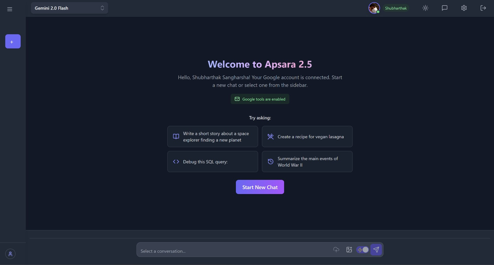
*Welcome screen with AI task suggestions*

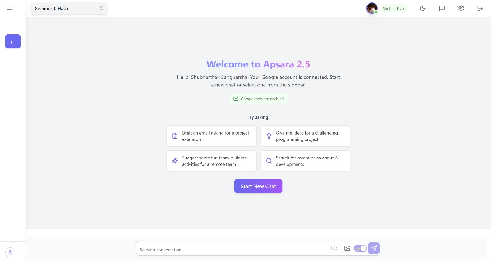
*Welcome screen with different AI task suggestions*

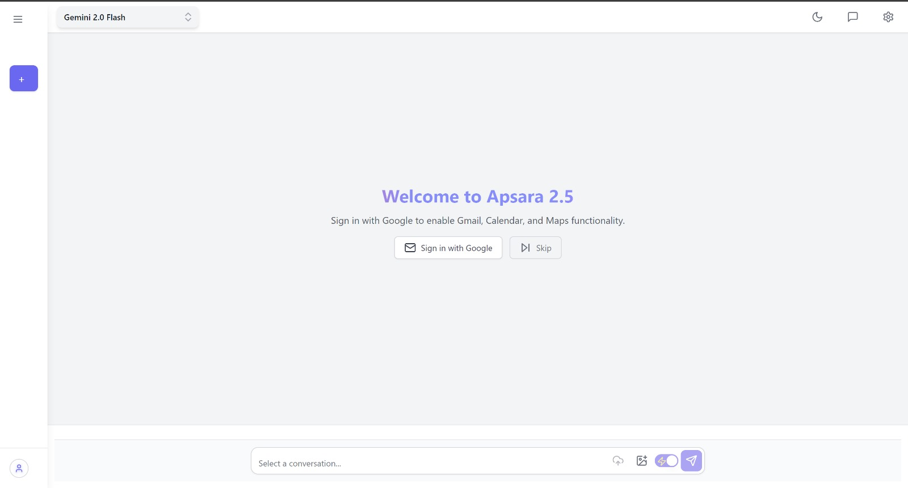
*Google authentication login screen*

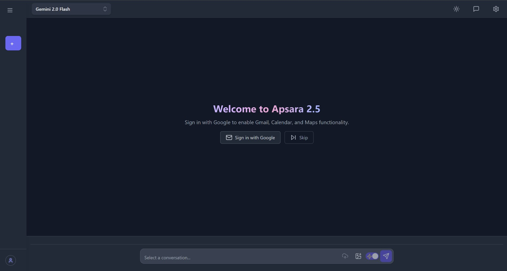
*Google sign-in option to enable Gmail, Calendar, and Maps functionality*

### Chat Interface

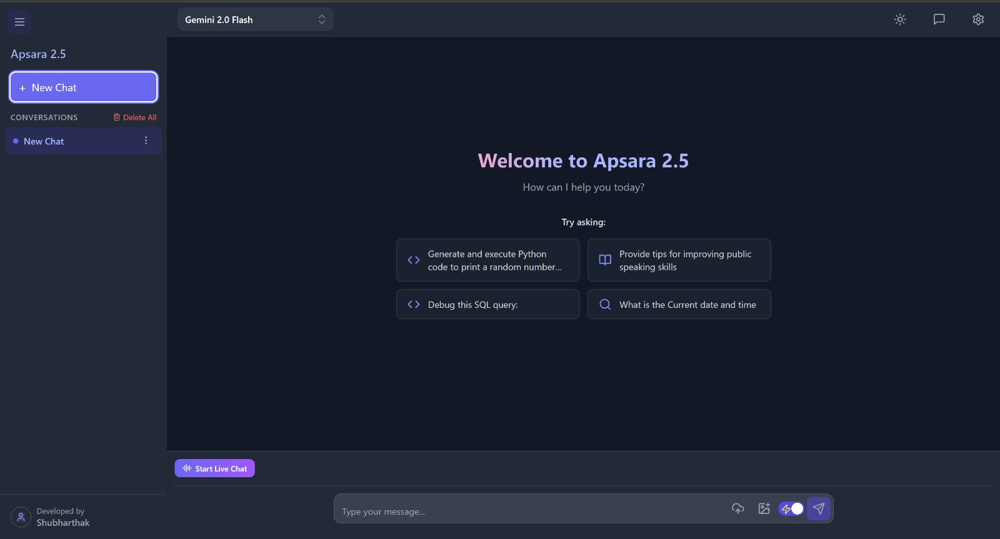
*Main chat interface with sidebar navigation*

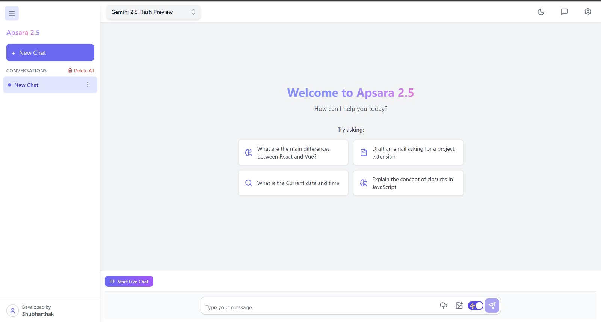
*Chat interface showing query suggestions*

### Live Session Features

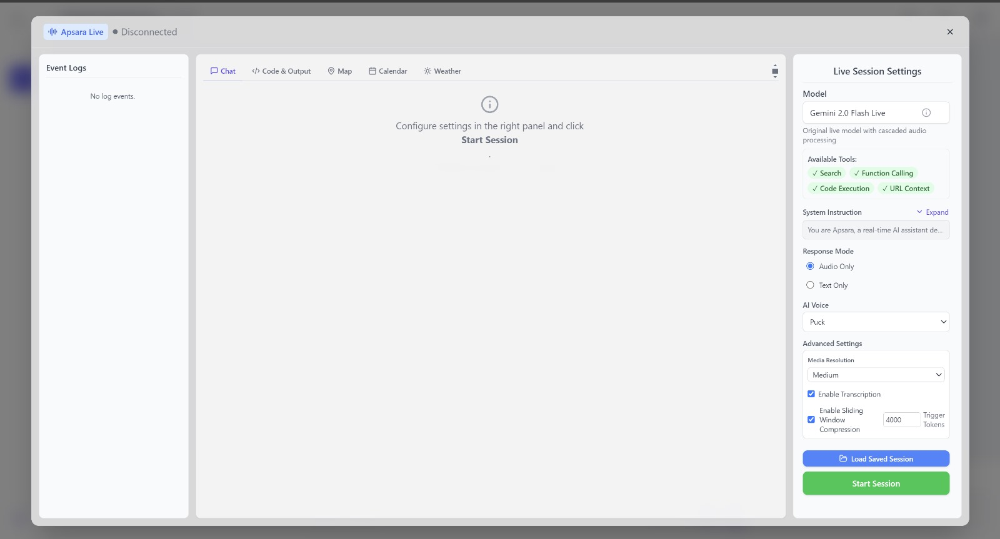
*Live session configuration screen with available tools*

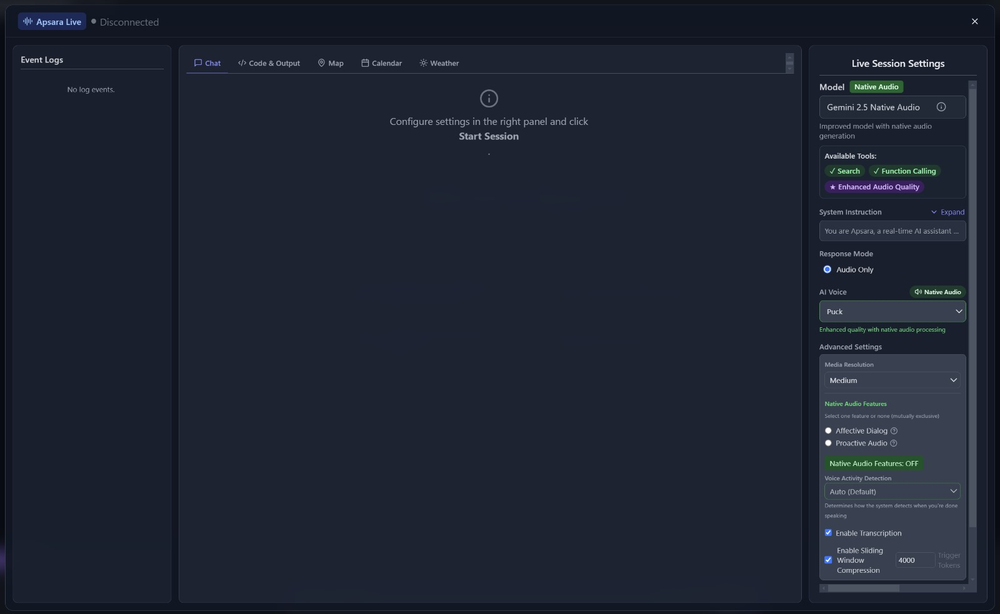
*Native audio settings with quality options and features*

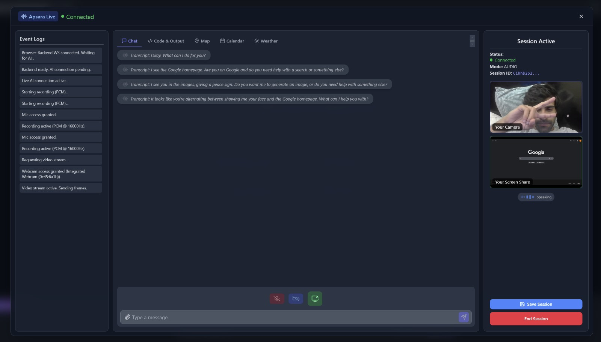
*Active live session with video and transcription*

### AI Capabilities

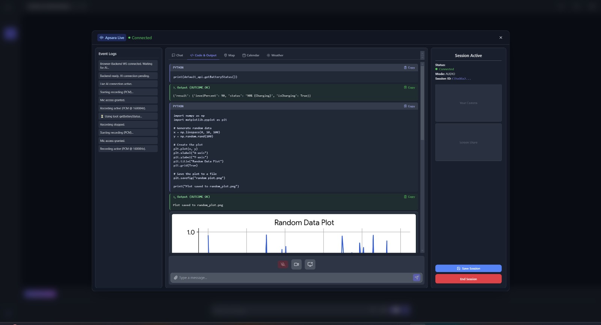
*Example of code generation and execution with data visualization*

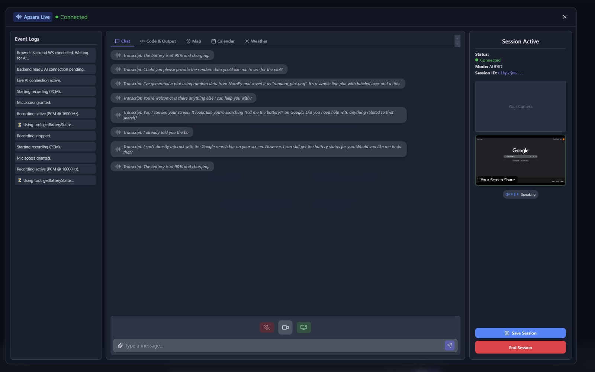
*Natural language conversation with the AI assistant*

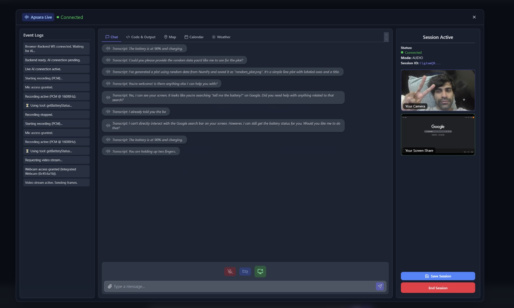
*Advanced interaction with the AI showing context awareness*

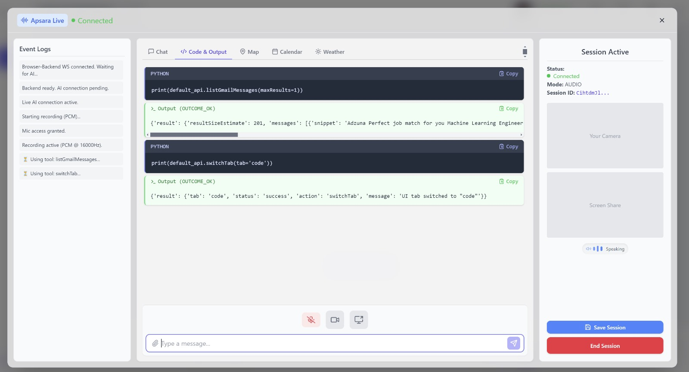
*Example of API integration with structured results*

## License
ISC License

## Author
Shubharthak